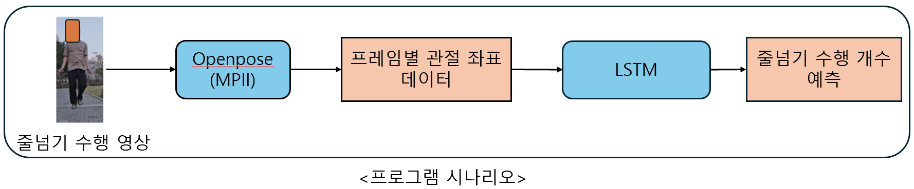
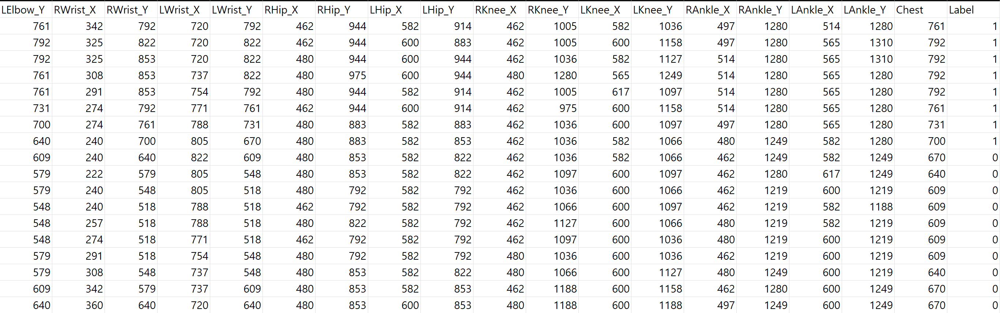
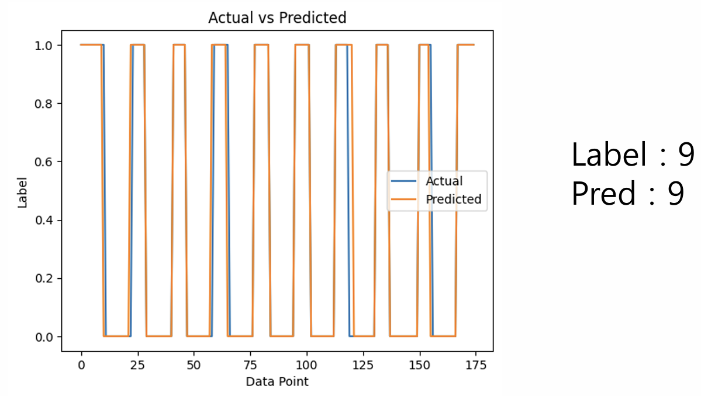

주제 : 딥러닝 기반 줄넘기 개수 측정 모델(개인 프로젝트)

기간 : 2024.03 ~ 2024.04

Github : [깃허브 url](https://github.com/KJirung/Jump-rope-count-measurement-program?tab=readme-ov-file)

### 프로그램 소개

줄넘기 개수 측정 프로그램은 인공지능 기술 기반으로 사용자의 줄넘기 수행 영상을 입력으로 받아 프레임별 각 관절 좌표 데이터를 이용하여 줄넘기 수행 개수를 측정하는 프로그램입니다.

### 개발 동기

줄넘기 운동은 빠른 템포와 호흡을 필요로 하기 때문에 개인이 목표 개수를 정해두어도 운동을 하다 보면 스스로 넘은 개수를 세는 것에 어려움을 겪곤 합니다. 이러한 어려움을 해결하기 위해 대부분은 스마트 워치를 이용해 사용자의 움직임을 감지하여 줄넘기를 넘은 개수를 측정하거나, 줄넘기를 돌리면 자동으로 개수가 측정되는 카운트 줄넘기를 사용하여 줄넘기를 넘은 개수를 측정합니다. 하지만 스마트 워치를 이용하는 방식은 비교적 고가의 스마트 워치를 소유해야만 사용할 수 있기 때문에 이용 가능 대상이 한정적이라는 단점이 존재하고, 카운트 줄넘기는 개수 측정의 정확도가 많이 떨어진다는 단점이 존재합니다.

줄넘기 개수 측정 프로그램은 스마트폰 등을 이용하여 사용자의 줄넘기 수행 영상을 녹화한 후 인공지능 모델을 이용하여 줄넘기 수행 개수를 측정하는 방식으로 스마트 워치를 이용하여 줄넘기 수행 개수를 측정하는 방식보다 이용 가능 대상자의 범위가 넓고, 카운트 줄넘기를 이용하여 줄넘기 수행 개수를 측정하는 방식보다 더 높은 정확도를 가진다는 장점이 있습니다.

### 기술 스택

- 프로그래밍 언어
  - Python

- 프레임 워크 및 라이브러리
  - Tensorflow
  - Openpose
  - OpenCV
  - Scikit-learn
  - Matplotlib
- 개발 도구 및 환경
  - Visual Studio Code

### 프로그램 시나리오

1. 사용자의 줄넘기 수행 영상을 입력으로 받음
2. openpose 라이브러리에서 제공하는 CNN 모델을 활용하여 프레임별 관절 좌표 데이터를 추출
3. 추출한 프레임별 관절 좌표 데이터를 바탕으로 줄넘기 수행 개수를 예측

### 결과

<figure class="half">
  
  
</figure>

​                                                    추출한 프레임별 관절 좌표 데이터와 LSTM 모델의 예측 결과

### 후기

데이터셋 없이 처음으로 진행한 프로젝트로 데이터셋 생성 및 수집부터 모델 학습까지 혼자 수행하면서 프로젝트 일련의 과정을 이해하고 여러 모델에 대해 비교 실험을 진행하는 방법에 대해 자세히 배울 수 있었습니다.

